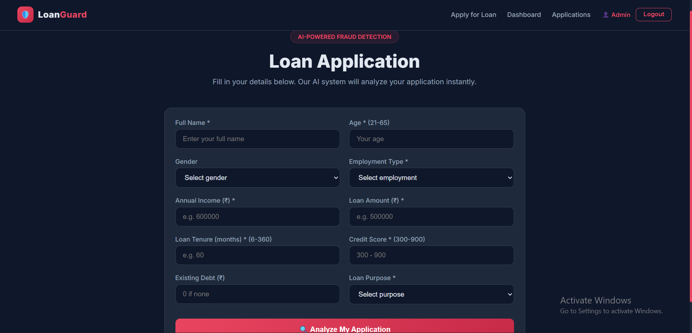
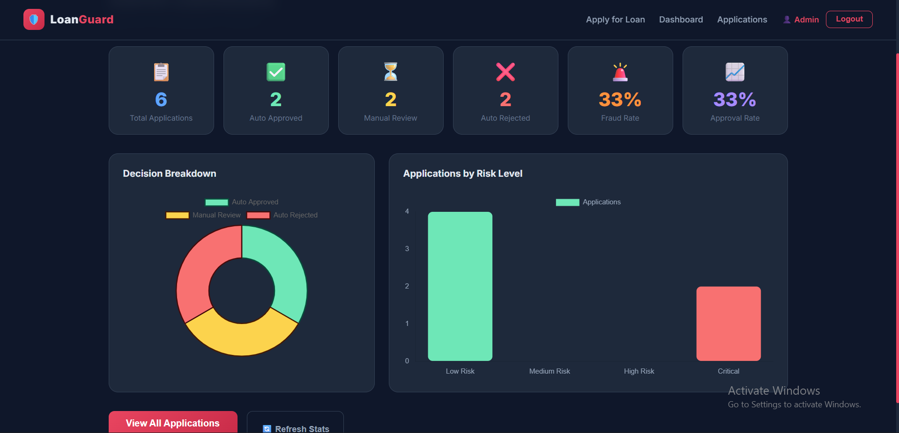
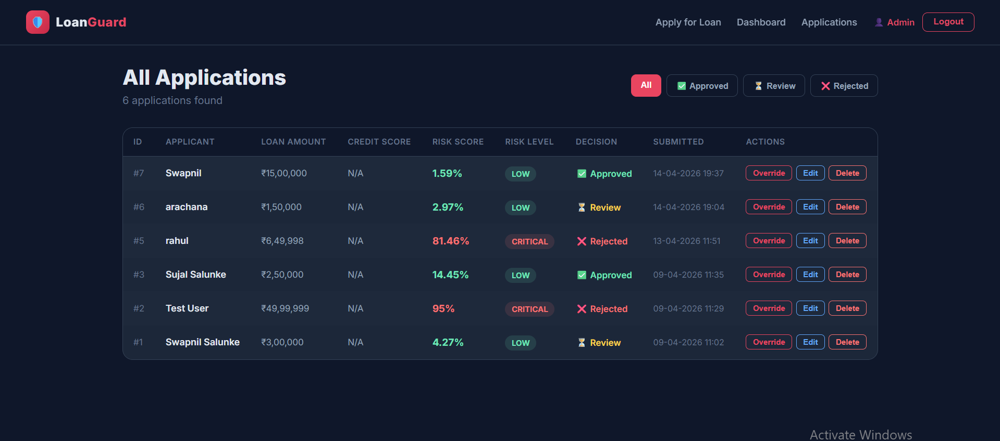

# 🛡️ LoanGuard — AI-Powered Loan Fraud Detection System


A full-stack loan fraud detection system with microservices 
architecture. Built with React frontend, Spring Boot REST API, 
and a Python Flask ML microservice serving a trained 
Random Forest model.

## 🚀 Live Demo
- Frontend: [Coming Soon]
- Backend API: [Coming Soon]

## 📸 Screenshots

### Loan Application Form


### Risk Analysis Result


### Admin Dashboard


### Applications Table


## 🏗️ System Architecture
React Frontend (Port 3000)
↓
Spring Boot Backend (Port 8080)
├── Rule Engine (Java)
├── JWT Authentication
└── MySQL Database
↓
Python Flask ML Service (Port 5000)
└── Random Forest Mode

## ✨ Key Features

- **AI Risk Scoring** — 0-100% fraud probability score
- **4-Tier Risk Classification** — Low, Medium, High, Critical
- **Explainable AI** — Shows exactly why application was flagged
- **Rule Engine** — Instant detection before ML model
- **Admin Dashboard** — Real-time charts and KPIs
- **JWT Authentication** — Secure admin access
- **BCrypt Passwords** — Encrypted password storage
- **Input Validation** — Server-side validation on all fields
- **Admin Override** — Manual decision override with audit log
- **Audit Logging** — Complete history of every action

## 🛠️ Tech Stack

| Layer | Technology |
|---|---|
| Frontend | React 19, Chart.js, React Router |
| Backend | Spring Boot 4, Spring Security, JPA |
| ML Service | Python, Flask, scikit-learn |
| ML Model | Random Forest (94%+ accuracy) |
| Database | MySQL 8 |
| Auth | JWT (JSON Web Tokens) |
| Security | BCrypt password hashing |
| Communication | REST API (Java ↔ Python) |

## 📁 Project Structure
LoanGuard/
├── frontend/          → React application
├── backend/           → Spring Boot application
│   └── src/main/java/com/loanguard/backend/
│       ├── controller/    → REST API endpoints
│       ├── service/       → Business logic + Rule Engine
│       ├── model/         → Database entities
│       ├── repository/    → JPA interfaces
│       ├── dto/           → Data transfer objects
│       └── security/      → JWT + BCrypt
├── ml-service/        → Python Flask ML service
│   ├── app.py         → Flask server
│   ├── model_trainer.py → Model training script
│   └── model.pkl      → Trained model
└── database/          → SQL scripts

## ⚙️ How To Run Locally

### Prerequisites
- Java 21+
- Node.js 22+
- Python 3.13+
- XAMPP (MySQL on port 3307)

### Step 1 — Database Setup
1. Start XAMPP → Start Apache and MySQL
2. Open `http://localhost/phpmyadmin`
3. Create database named `loanGuard`
4. Run the SQL script from `database/schema.sql`

### Step 2 — ML Service
```bash
cd ml-service
pip install -r requirements.txt
python model_trainer.py
python app.py
```
ML service runs on `http://localhost:5000`

### Step 3 — Backend
```bash
cd backend
.\mvnw.cmd spring-boot:run
```
Backend runs on `http://localhost:8080`

### Step 4 — Frontend
```bash
cd frontend
npm install
npm start
```
Frontend runs on `http://localhost:3000`

## 🔑 Default Admin Credentials
Email:    admin@loanGuard.com
Password: admin123

## 📊 API Endpoints

| Method | Endpoint | Access |
|---|---|---|
| POST | /api/auth/login | Public |
| POST | /api/applications/submit | Public |
| GET | /api/applications/all | Admin only |
| GET | /api/dashboard/stats | Admin only |
| PUT | /api/applications/{id}/override | Admin only |

## 🤖 ML Model Details
- Algorithm: Random Forest Classifier
- Training samples: 5000 synthetic loan records
- Accuracy: 94%+
- Features: Age, Income, Loan Amount, Credit Score, 
  Debt Ratio, Employment Type, Loan Purpose

## 👨‍💻 Author
**Swapnil Salunke**
- LinkedIn: [your-linkedin-url]
- GitHub: [your-github-url]
- Email: salunkeswapnil264@gmail.com